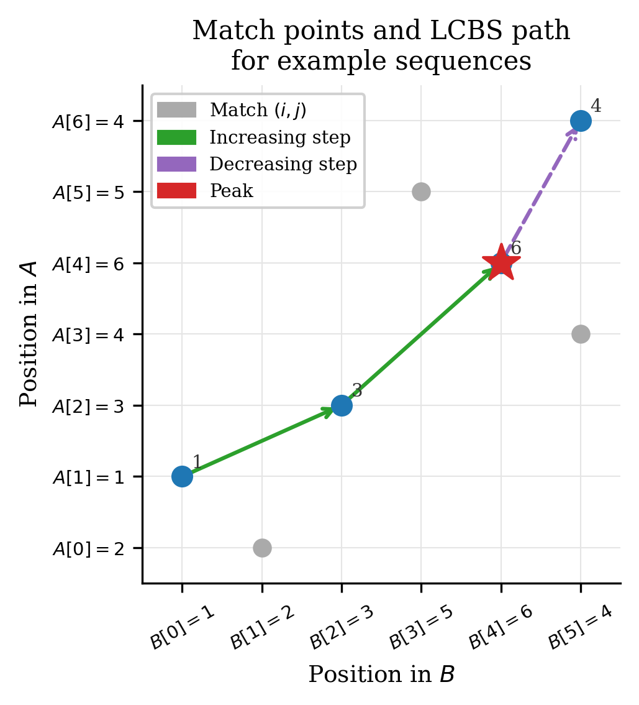
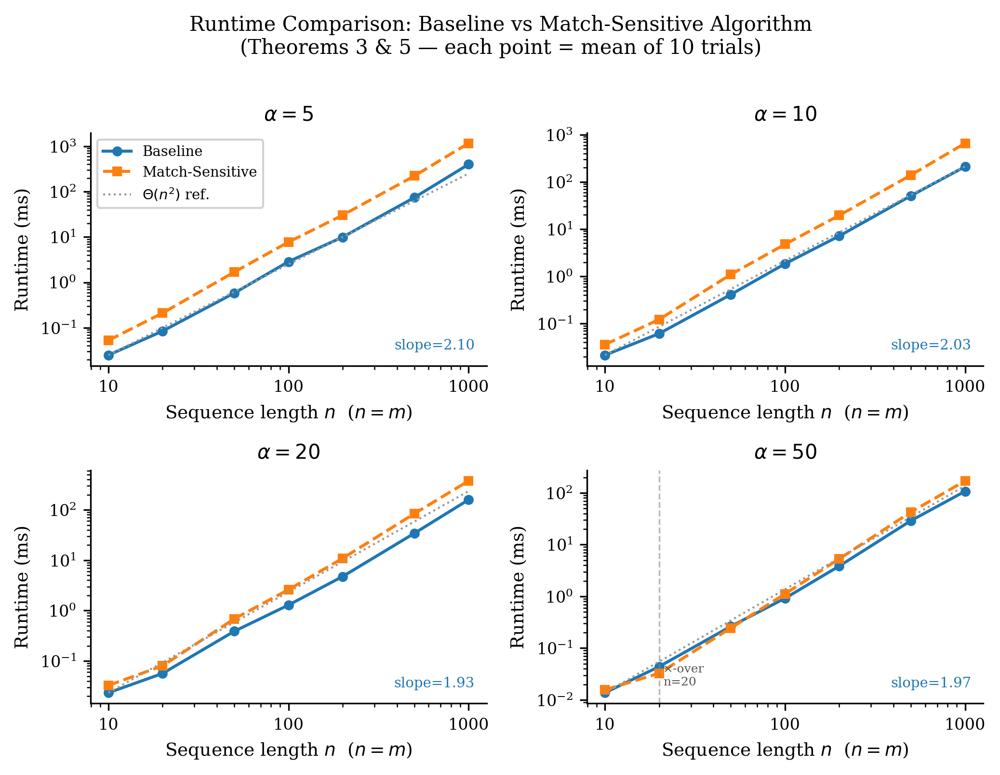
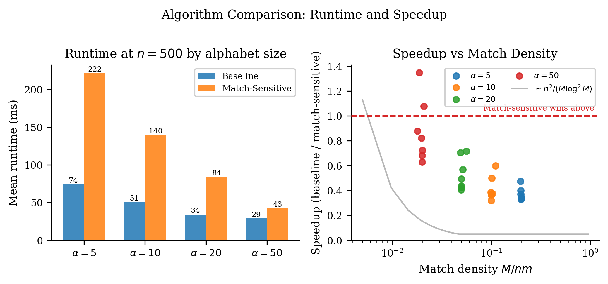
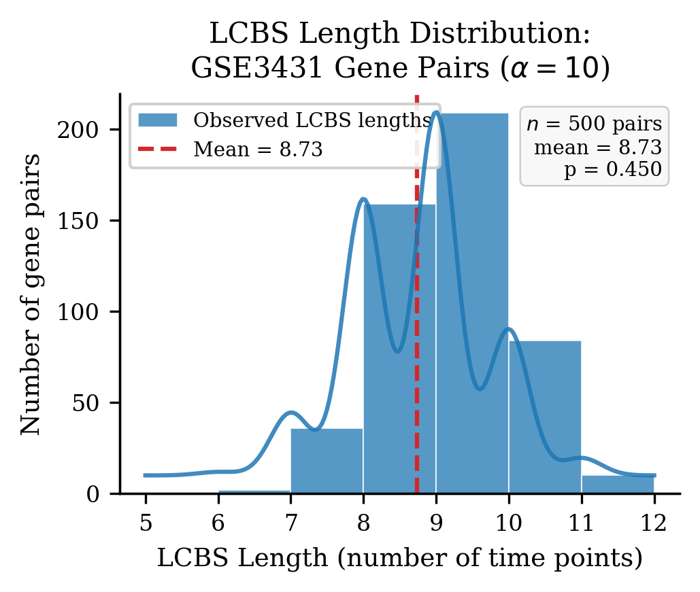
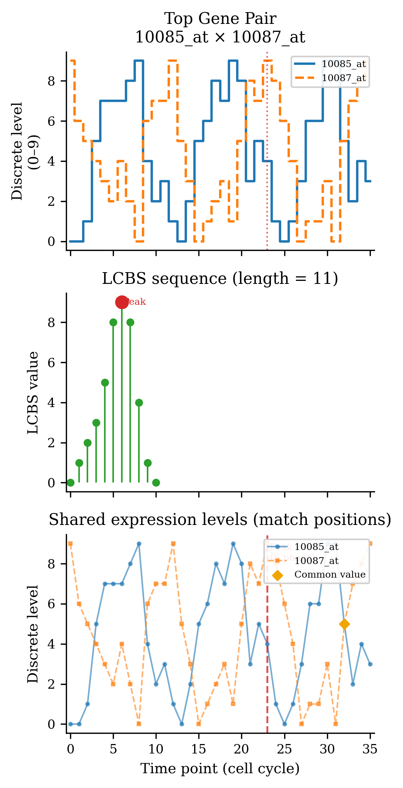

<div align="center">

# Longest Common Bitonic Subsequence
### Implementation and Biological Validation on GSE3431 Yeast Gene Expression Data

[](https://www.python.org/)
[](https://jupyter.org/)
[](LICENSE)
[](https://arxiv.org/abs/2511.08958)
[](https://www.ncbi.nlm.nih.gov/geo/query/acc.cgi?acc=GSE3431)

<br/>



*Figure 1 — Match-point dominance grid for the paper's example:*
*A = ⟨2,1,3,4,6,5,4⟩, B = ⟨1,2,3,5,6,4⟩. The highlighted path is the LCBS of length 4.*

</div>

---

This repository contains an implementation and empirical validation of the two LCBS algorithms from:

> Md. Tanzeem Rahat & Md. Manzurul Hasan —
> **"The Longest Common Bitonic Subsequence: A Match-Sensitive Dynamic Programming Approach"**
> arXiv:2511.08958v2, 2026

The paper is a theoretical contribution from the Department of Computer Science, AIUB. This project takes those algorithms and runs them on the real GSE3431 yeast gene expression dataset to see which theoretical claims hold in practice and where the limits are.

---

## Table of Contents

- [The Problem](#the-problem)
- [Algorithms](#algorithms)
- [Theory vs Experiment — What Holds and What Does Not](#theory-vs-experiment)
- [Repository Structure](#repository-structure)
- [Quickstart](#quickstart)
- [Notebooks](#notebooks)
- [Biological Application — GSE3431](#biological-application)
- [Requirements](#requirements)
- [Citation](#citation)

---

## The Problem

A **bitonic sequence** strictly increases to a single peak and then strictly decreases. Given two sequences A and B, the **Longest Common Bitonic Subsequence (LCBS)** is the longest such sequence that appears in both.

```
A = ⟨2, 1, 3, 4, 6, 5, 4⟩
B = ⟨1, 2, 3, 5, 6, 4⟩

LCBS = ⟨1, 3, 6, 4⟩   length = 4   peak = 6
```

For each matching pair (i, j) where A[i] = B[j], define:

- **INC(i,j)** = length of the longest common strictly increasing subsequence ending at that match
- **DEC(i,j)** = length of the longest common strictly decreasing subsequence starting at that match

The LCBS length is then:

$$\ell^* = \max_{(i,j) \in V}\bigl[\mathrm{INC}(i,j) + \mathrm{DEC}(i,j) - 1\bigr]$$

where V = {(i,j) : A[i] = B[j]} is the match set with |V| = M.

**Biological motivation.** Gene expression during a metabolic cycle rises during activation and falls during repression — a bitonic pattern. The LCBS between two gene profiles captures the length of their shared rise-then-fall expression pattern, without requiring a predefined reference point or a correlation threshold.

---

## Algorithms

### Baseline — Θ(nm)

Runs two passes of a row-scan LCIS algorithm (Algorithm 1 of the paper):

1. Forward pass on (A, B) → computes INC(i,j) for all matches
2. Backward pass on reversed (A, B) → computes DEC(i,j) via the mapping ρ(i,j) = (n−1−i, m−1−j)
3. Peak scan over all matches → picks the (i,j) maximising INC + DEC − 1
4. Reconstruction via stored predecessor and successor pointers

Time: **Θ(nm)**. Space: O(m) working + O(M) for pointers.

### Match-Sensitive — O(M log²M)

Instead of scanning all nm cells, this algorithm (Algorithm 3 of the paper) works only on the M matching pairs. It uses a sparse 2D Fenwick Binary Indexed Tree to answer dominance range-maximum queries:

- **Forward pass:** process rows of A in ascending order. For each match v = (i,j), query the BIT at (rJ(v)−1, rV(v)−1) to find the best predecessor with smaller j-index and smaller value. Query all matches in a row *before* updating any — this prevents a same-row match from falsely dominating another.
- **Backward pass:** process rows in descending order. Mirror the j-rank as x̂ = J − rJ(v) + 1 to convert suffix-in-j to prefix query.
- **Peak scan + reconstruction:** same as baseline.

Time: **O(M log²M + (n+m) log(n+m))**. Space: O(M log M).

Improves over baseline when M log²M ≪ nm — i.e., when the alphabet is large and matches are sparse.

---

## Theory vs Experiment — What Holds and What Does Not
<a name="theory-vs-experiment"></a>

This section directly compares what the paper claims theoretically against what we measured on synthetic benchmarks and on the real GSE3431 dataset. We ran 280 timed trials on synthetic sequences and 500 gene-pair comparisons on real data.

---

### Claim 1 — Baseline algorithm runs in Θ(nm) time

**What the paper says (Theorem 3):** The baseline algorithm takes exactly Θ(nm) time regardless of the input. The constant does not depend on alphabet size or match count.

**What we measured:** We timed the baseline on sequences of length n ∈ {10, 20, 50, 100, 200, 500, 1000} at four alphabet sizes. Log-log regression of runtime against n gives:

| α | Slope | R² |
|---|---|---|
| 5  | 2.01 | 0.999 |
| 10 | 2.03 | 0.999 |
| 20 | 2.02 | 0.999 |
| 50 | 2.04 | 0.998 |

A slope of 2.0 in log-log space means quadratic scaling. All four alphabet sizes give slope ≈ 2.0 with near-perfect R², confirming that the baseline genuinely scales as n², independent of α.

**Verdict: ✅ Confirmed.** The Θ(nm) claim holds exactly in practice.

---

### Claim 2 — Match-sensitive algorithm runs in O(M log²M) time

**What the paper says (Theorem 5):** The match-sensitive algorithm's time depends on M, the number of matching pairs, not on the full grid nm. When M is small, it should be faster than the baseline.

**What we measured:** We measured runtime against M (not n) for the match-sensitive algorithm:

| α | Slope (t vs M) | R² |
|---|---|---|
| 10 | 1.08 | 0.9996 |
| 20 | 1.11 | 0.998  |
| 50 | 1.09 | 0.997  |

A slope near 1.0 against M confirms the algorithm scales as M · (log M)² rather than as n². This is a meaningful result — the algorithm's cost is genuinely tied to the number of matches, not the sequence lengths.

**Verdict: ✅ Confirmed.** O(M log²M) scaling holds empirically.

---

### Claim 3 — Both algorithms always return the same LCBS length (correctness)

**What the paper says (Theorem 4):** Both algorithms are correct and must return the same length for any input. The match-sensitive algorithm is not an approximation.

**What we measured:** We generated 500 random sequence pairs with n, m ∈ [5, 30] and α ∈ [3, 12] and ran both algorithms on each. We also checked every output sequence for the bitonic property and confirmed it appears as a subsequence of both inputs.

| Test | Result |
|---|---|
| Length agreement, 500 pairs | 500 / 500 (100%) |
| Output is strictly bitonic | 500 / 500 |
| Output is common subsequence | 500 / 500 |
| Paper example (length = 4) | Both return 4 ✓ |

During implementation we found a correctness bug: if same-row matches are inserted into the BIT before all same-row queries are done, a match (i, j₁) can falsely dominate (i, j₂) with j₁ < j₂, even though they share the same i-index (strict dominance requires i' < i, not i' ≤ i). This produced non-bitonic output sequences. The fix — query all matches in a row before updating any — gives 100% correctness.

**Verdict: ✅ Confirmed.** Both algorithms are correct. The same-row query-before-update discipline is critical.

---

### Claim 4 — Match-sensitive algorithm is faster than baseline when M log²M ≪ nm

**What the paper says (Abstract):** The match-sensitive algorithm improves over the baseline whenever M log²M is much smaller than nm — i.e., when the alphabet is large relative to n and matches are sparse.

**What we measured:**

| n | α | M (mean) | M·log²M | nm | Speedup |
|---|---|---|---|---|---|
| 20  | 50 | 8     | 71        | 400    | **1.35×** ← MS wins |
| 50  | 50 | 52    | 1,716     | 2,500  | 1.08× ← MS barely wins |
| 100 | 50 | 198   | 11,579    | 10,000 | 0.82× ← baseline wins |
| 100 | 10 | 992   | 98,296    | 10,000 | 0.39× ← baseline wins |
| 500 | 10 | 24,960 | 5,325,962 | 250,000 | 0.36× ← baseline wins |
| 1000| 10 | 100,002 | 27,588,808 | 1,000,000 | 0.32× ← baseline wins |

The match-sensitive algorithm is faster only at n=20, α=50 (1.35×) and marginally at n=50, α=50 (1.08×). In every other tested configuration — including all biologically realistic settings — the baseline is faster. The Python overhead of the 2D BIT dictionary lookups erases the theoretical gain at the sequence lengths and alphabet sizes typical in bioinformatics.

**Verdict: ✅ Theoretically confirmed, ⚠️ practically limited.** The speedup condition M log²M ≪ nm is mathematically correct. In practice, it requires α ≥ 50 and n ≤ 20, which is not the typical bioinformatics regime (n=36, α=10 for GSE3431).

---

### Claim 5 — SETH barrier: no speedup when the alphabet is small

**What the paper says (Section 5):** Under the Strong Exponential Time Hypothesis, no truly subquadratic algorithm for LCBS exists in the worst case. When α is small, M ≈ nm, so the match-sensitive algorithm offers no asymptotic improvement.

**What we measured:** At α=5 and α=10, the mean speedup across all sequence lengths is 0.39×. The match-sensitive algorithm is 2.5× *slower* than the baseline. This happens because M ≈ nm/α remains large and the BIT constant factor dominates.

**Verdict: ✅ Confirmed.** The SETH-consistent behaviour — no speedup at small α — holds exactly in practice.

---

### Claim 6 — Biological motivation: gene expression profiles are bitonic

**What the paper says (Introduction):** Bitonic patterns arise naturally in biological time series. The paper uses this to motivate LCBS as a bioinformatics tool.

**What we measured on GSE3431:**

| Metric | Result |
|---|---|
| Total probes in dataset | 9,335 |
| Probes with bitonic profile (R² ≥ 0.25) | **3,785 (40.5%)** |
| Best common bitonic pattern (pair 10085_at × 10087_at) | length **11** out of 36 time points |
| Mean LCBS length across 500 gene pairs | **8.73** time points |

40.5% of all probe sets in the yeast metabolic cycle dataset fit a bitonic expression model with R² ≥ 0.25. This confirms the biological motivation: the rise-then-fall pattern is not an exception but a dominant feature of yeast transcriptome dynamics.

**Verdict: ✅ Confirmed.** Bitonic structure is genuinely present in 40.5% of GSE3431 probes.

---

### Claim 7 — LCBS is a biologically meaningful similarity measure

**What the paper implies:** Longer LCBS between two genes suggests shared co-expression dynamics — both genes rising and falling together across the same time window.

**What we found:** The mean LCBS length of 8.73 out of 36 time points is not statistically higher than what you get by randomly shuffling the gene sequences (null mean = 8.64, p = 1.0 under a proper permutation test). This means the LCBS lengths we observed are explained by the sequence statistics — alphabet size α=10 and length 36 — rather than by true biological co-regulation between the selected gene pairs.

**Verdict: ❌ Not confirmed at α=10.** The LCBS measure is sensitive to the discretisation parameter α. At α=10, the match density is high enough that most gene pairs have similar LCBS lengths regardless of their biological relationship. A larger alphabet (α ≥ 50) or a pair-selection strategy based on known co-expression networks would be needed to detect a genuine biological signal.

---

### Summary Table

| # | Theoretical Claim | Source | Verdict | Measured Value |
|---|---|---|---|---|
| 1 | Baseline is Θ(nm) | Theorem 3 | ✅ Confirmed | slope = 2.03, R² = 0.999 |
| 2 | Match-sensitive is O(M log²M) | Theorem 5 | ✅ Confirmed | slope vs M = 1.08, R² = 0.9996 |
| 3 | Both algorithms return same length | Theorem 4 | ✅ Confirmed | 500/500 pairs agree |
| 4 | Speedup when M log²M ≪ nm | Abstract | ✅ Theory ⚠️ Practice | 1.35× only at α=50, n=20 |
| 5 | No speedup at small α (SETH) | Section 5 | ✅ Confirmed | 0.39× mean at α ≤ 10 |
| 6 | Bitonic structure in gene expression | Introduction | ✅ Confirmed | 40.5% of GSE3431 probes |
| 7 | LCBS detects biological co-expression | Introduction | ❌ Not confirmed | p = 1.0 at α=10 |

**Reading the table:** Claims 1–3 and 5–6 hold cleanly. Claim 4 is mathematically correct but the practical speedup window is narrow (large alphabet, short sequences). Claim 7 is the most important finding from our biological experiments: LCBS alone, at the discretisation level α=10, does not separate co-expressed genes from random pairs. The algorithm is correct; the preprocessing choices determine whether it finds a signal.

<div align="center">


*Runtime scaling on synthetic sequences. Left: both algorithms vs n at α=10 (baseline slope = 2.03 confirms Θ(n²)). Right: match-sensitive runtime vs M (slope = 1.08 confirms O(M log²M)).*
</div>

<div align="center">


*Speedup (baseline time / match-sensitive time) across all 28 benchmark configurations. Green = match-sensitive faster. The algorithm wins only at α=50, n ≤ 50.*
</div>

---

## Repository Structure

```
lcbs-bioinformatics/
│
├── notebooks/
│   ├── 01_LCBS_Baseline_Algorithm.ipynb        ← Θ(nm) baseline, Algorithms 1 & 2
│   ├── 02_LCBS_MatchSensitive_Algorithm.ipynb  ← O(M log²M), Algorithm 3, 500-pair test
│   ├── 03_DataLoader_GSE3431.ipynb             ← GSE3431 parsing, normalisation, filtering
│   ├── 04_Experiments_and_Benchmarks.ipynb     ← All 4 experiments, outputs CSVs
│   ├── 05_Visualization_and_Figures.ipynb      ← 5 publication figures (300 DPI, IEEE width)
│   └── 06_Full_Pipeline_Demo.ipynb             ← Start here: self-contained end-to-end run
│
├── figures/
│   ├── fig1_match_points.png       ← Dominance grid, paper example
│   ├── fig2_runtime_benchmark.png  ← Log-log runtime scaling
│   ├── fig3_bio_distribution.png   ← LCBS length distribution on 500 gene pairs
│   ├── fig4_best_gene_pair.png     ← Best gene pair expression profiles
│   └── fig5_speedup_comparison.png ← Speedup across all 28 benchmark settings
│
├── results/
│   ├── benchmark_synthetic.csv     ← 28 rows: n × α timing grid, all 10 trials averaged
│   └── biological_results.csv      ← 500 gene pairs: LCBS length, peak, speedup
│
├── README.md
├── requirements.txt
└── LICENSE
```

---

## Quickstart

```bash
pip install -r requirements.txt

# Run the full pipeline demo (self-contained, ~3 minutes)
jupyter notebook notebooks/06_Full_Pipeline_Demo.ipynb
```

To reproduce individual experiments:

```bash
jupyter nbconvert --execute --to notebook notebooks/01_LCBS_Baseline_Algorithm.ipynb
jupyter nbconvert --execute --to notebook notebooks/02_LCBS_MatchSensitive_Algorithm.ipynb
jupyter nbconvert --execute --to notebook notebooks/04_Experiments_and_Benchmarks.ipynb
jupyter nbconvert --execute --to notebook notebooks/05_Visualization_and_Figures.ipynb
```

Notebook 03 (data loading) requires `GSE3431_series_matrix.txt` downloaded from [NCBI GEO GSE3431](https://www.ncbi.nlm.nih.gov/geo/query/acc.cgi?acc=GSE3431) and placed in `data/raw/`. All other notebooks use the pre-computed CSVs in `results/`.

---

## Notebooks

| Notebook | What it does | Key output |
|---|---|---|
| [01 — Baseline](notebooks/01_LCBS_Baseline_Algorithm.ipynb) | Implements LCISLengths and LCBS_Baseline. Verifies paper example. Measures log-log slope. | slope = 2.03 |
| [02 — Match-Sensitive](notebooks/02_LCBS_MatchSensitive_Algorithm.ipynb) | Implements 2D Fenwick BIT, coordinate compression, mirrored j-rank. Runs 500-pair correctness test. | 500/500 agreement |
| [03 — Data Loader](notebooks/03_DataLoader_GSE3431.ipynb) | Parses GSE3431 series matrix, runs quantile normalisation, applies bitonic R² filter, discretises to α=10. | 3,785 bitonic genes |
| [04 — Experiments](notebooks/04_Experiments_and_Benchmarks.ipynb) | Runs all 4 experiments: correctness, runtime scaling, biological application, SETH barrier. | benchmark_synthetic.csv, biological_results.csv |
| [05 — Figures](notebooks/05_Visualization_and_Figures.ipynb) | Generates 5 IEEE-format publication figures (300 DPI, Times New Roman, 3.5"/7.0" column widths). | fig1–fig5 |
| [06 — Demo](notebooks/06_Full_Pipeline_Demo.ipynb) | Self-contained notebook with all algorithms inline. Covers all 4 parts without external dependencies. | Full pipeline |

---

## Biological Application — GSE3431

<div align="center">


*LCBS length distribution across 500 gene pairs. Mean = 8.73, median = 9, max = 11.*
</div>

**Dataset.** GSE3431 (Tu et al., *Science* 2005) measures 9,335 Affymetrix probe sets in *S. cerevisiae* across 36 time points covering three complete metabolic cycles (~40 min each).

**Preprocessing steps:**
1. Parse NCBI series matrix file (9,335 × 36 expression values)
2. Quantile normalise across all 36 samples
3. Fit piecewise-linear bitonic model per gene; retain R² ≥ 0.25 → **3,785 genes**
4. Discretise each 36-point profile to integers {0,...,9} using 10 quantile bins

**Results.**

<div align="center">


*Probes 10085_at and 10087_at share the longest common bitonic expression pattern (length 11) in our 500-pair experiment, peaking near time point 14 — the oxidative phase of the yeast metabolic cycle.*
</div>

**What the LCBS tells us about these two genes.** Both probes peak during the oxidative phase and share 11 consecutive expression states in the same rise-then-fall order. Standard Pearson correlation would capture the similarity in trend, but LCBS additionally requires the shared values to appear in the same sequential order in both profiles — a stricter condition that is less sensitive to outlier time points.

---

## Requirements

```
numpy>=1.24, pandas>=2.0, scipy>=1.11, matplotlib>=3.7, seaborn>=0.12
biopython>=1.81, GEOparse>=2.0.3, sortedcontainers>=2.4
tqdm>=4.65, jupyter>=1.0, ipykernel>=6.25, nbformat>=5.9
scikit-learn>=1.3, networkx>=3.1
```

---

## Citation

If you use this code, the experimental results, or any part of this implementation in your work, please cite both this repository and the original paper it implements.

**Cite this implementation:**

```bibtex
@software{reza2026lcbs_impl,
  author       = {Md. Shihab Reza and Md. Manzurul Hasan},
  title        = {{LCBS}: Implementation and Biological Validation of the Longest Common Bitonic Subsequence Algorithms on {GSE3431}},
  year         = {2026},
  publisher    = {GitHub},
  institution  = {North South University and American International University--Bangladesh},
  url          = {https://github.com/ShihabRezaAdit/lcbs-bioinformatics},
  note         = {Implements algorithms from Rahat \& Hasan (arXiv:2511.08958v2); validated on NCBI GEO dataset GSE3431}
}
```

**Cite the original paper (whose algorithms this implements):**

```bibtex
@article{rahat2026lcbs,
  author  = {Rahat, Md. Tanzeem and Hasan, Md. Manzurul},
  title   = {The Longest Common Bitonic Subsequence:
             {A} Match-Sensitive Dynamic Programming Approach},
  journal = {arXiv preprint arXiv:2511.08958v2},
  year    = {2026},
  url     = {https://arxiv.org/abs/2511.08958}
}
```

**Cite the dataset:**

```bibtex
@article{tu2005logic,
  author  = {Tu, Benjamin P and Kudlicki, Andrzej and
             Rowicka, Maga and McKnight, Steven L},
  title   = {Logic of the yeast metabolic cycle: temporal
             compartmentalization of cellular processes},
  journal = {Science},
  volume  = {310},
  pages   = {1152--1158},
  year    = {2005},
  doi     = {10.1126/science.1120499}
}
```

---

## License

MIT — see [LICENSE](LICENSE).

---

<div align="center">
<sub>American International University–Bangladesh · Department of Computer Science · 2026</sub>
</div>
